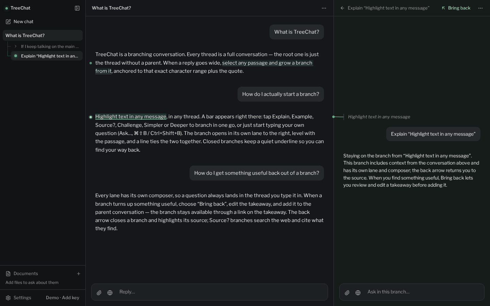

# TreeChat

A branching AI chat. Select any passage in a reply to explore it in a side **branch** that opens in its own lane beside the passage, then bring the takeaway back to the conversation it came from.

**Try it:** [akarshgopal.github.io/treechat](https://akarshgopal.github.io/treechat/). It works straight away with demo replies; add your own [OpenRouter](https://openrouter.ai/) key in Settings for real answers. There is no TreeChat server and no account: everything runs and stays in your browser.



Found a bug or have an idea? [Open an issue](https://github.com/akarshgopal/treechat/issues/new) (also under **Report a problem** in Settings and the command palette).

Built with Vite, React, TypeScript, Tailwind CSS, shadcn/ui, and TanStack AI (`useChat`). Production is a **static GitHub Pages** app: paste an **OpenRouter API key** in Settings (gear). The key stays in `localStorage` and the browser calls OpenRouter directly (BYOK). With no key, a polished mock stream keeps the whole UX clickable — including on Pages, with no API server.

## Setup

```bash
pnpm install
pnpm dev
```

Open the printed local URL (Vite defaults to http://localhost:5173).

```bash
pnpm build      # production bundle → dist/
pnpm preview    # serve the build (Vite plugin still handles /api/chat for mock / env fallbacks)
```

## Bring your own key (OpenRouter)

1. Open **Settings** (bottom of the sidebar; the gear in the app bar on phones).
2. Paste an [OpenRouter](https://openrouter.ai/) API key and pick a model (default `openai/gpt-5.6-luna`). The model picker opens a searchable list of OpenRouter's public models, newest first after a few suggestions, with each model's price per million tokens (input / output), context size, image support and free models marked. To use a model that is not listed, paste its full id and choose **Use “…”**.
3. **Save**. The sidebar's `Demo · Add key` note disappears.
4. **Remove key** forgets the key in this browser; the model and generation params stay saved.
5. Optionally set a **Background model** for summaries and takeaway drafts — e.g. a free `:free` model. Free models may log prompts and have low rate limits; on an error TreeChat retries once with the main model.

**Usage.** With a key saved, Settings shows what the key has spent (today, this month, in total), its credit limit and what is left, straight from OpenRouter. Each reply shows the model that answered, its tokens and its cost; hover it for input and output tokens separately. Costs of background work (summaries, takeaway drafts, image descriptions) count toward the key but are not shown per reply.

Stored under `treechat:provider:v1` in `localStorage`. **Treat the key like a password**, and prefer a key with a [credit limit](https://openrouter.ai/settings/keys): anyone with access to this browser profile can read it, and so could any script running on this site's address (on `*.github.io`, that address is shared by every Pages site of the same account). Every chat request sends it from this page to OpenRouter (`Authorization: Bearer …`); TreeChat's host never sees it.

When a key is set, chat streams from `https://openrouter.ai/api/v1/chat/completions` in the browser (`stream: true`, plus `HTTP-Referer` and `X-Title`). It does **not** call `/api/chat`.

While waiting for the first visible token, the thread shows elapsed waiting time. Provider errors, including errors delivered inside an HTTP 200 stream, are displayed with a retry action.

Requests in one chat share an OpenRouter `session_id` to support sticky provider routing. Prompt caching remains provider/model dependent and requires a matching prefix; this does not guarantee cache hits or a specific response time. See [OpenRouter prompt caching](https://openrouter.ai/docs/guides/best-practices/prompt-caching).

## Mock mode (no key)

- **GitHub Pages:** the mock stream runs entirely in the browser. There is no `/api/chat`.
- **Local `pnpm dev` / `pnpm preview`:** the Vite plugin still serves `/api/chat` (mock, or a live env-key fallback if you set one). If that plugin is absent, the same in-browser mock is used.

## Environment variables

Copy `.env.example` to `.env`. Production BYOK is client-side; these keys are **optional local fallbacks** for `pnpm dev` / `pnpm preview` only. Leave every key blank to run in **mock** mode.

| Variable | Purpose |
| --- | --- |
| `XAI_API_KEY` | SpaceXAI / xAI fallback. Server calls `https://api.x.ai/v1`. |
| `XAI_MODEL` | Defaults to `grok-4.6`. |
| `OPENAI_API_KEY` | Used if `XAI_API_KEY` is unset. |
| `OPENAI_MODEL` | Defaults to `gpt-4.1-mini`. |
| `OPENROUTER_API_KEY` | Used if neither xAI nor OpenAI is set. |
| `OPENROUTER_MODEL` | Defaults to `openai/gpt-5.6-luna`. |
| `VITE_BASE` | Public path. Defaults to `/` locally. In GitHub Actions, `GITHUB_REPOSITORY` (`akarshgopal/treechat`) sets `/treechat/`. Use `VITE_BASE=/` for a user/org site at the domain root. |

Do not prefix provider keys with `VITE_`. A Settings OpenRouter key always wins over env.

## Deploy to GitHub Pages

The app is a static `dist/` site. Hosting is GitHub Pages (no Cloudflare Pages Functions).

Project site URL: `https://akarshgopal.github.io/treechat/` (Vite `base` `/treechat/`).

1. In the repo: **Settings → Pages → Build and deployment → Source: GitHub Actions**.
2. Push to `main` (or run the **Deploy GitHub Pages** workflow). `.github/workflows/pages.yml` runs `pnpm test`, the Playwright suite (Chromium; a failure blocks the deploy and uploads the report and traces as the `playwright-report` artifact), `pnpm build`, and uploads `dist`.
3. Vite base is `/treechat/` when `GITHUB_REPOSITORY` is `*/treechat`. Override with `VITE_BASE=/` for `https://<user>.github.io/`.
4. Local production build meant for Pages: `VITE_BASE=/treechat/ pnpm build`.

No secrets belong in the workflow. Users paste OpenRouter keys in Settings.

## How branching works

1. **Downward is time, rightward is depth.** Every thread on the open path gets a full-height lane with its own composer. A branch starts level with the passage it grew from (sliding up only as far as it needs to stay fully visible), and a line in the gutter ties the two together as they scroll; while a branch is answering the line flows, and it pulses once when the reply is ready. When the passage scrolls out of view, a **↑/↓ Passage** pill at the lane's edge scrolls back to it. Drag a gutter (or focus it and use ←/→) to resize the lane to its right; double-click resets it. Every lane has the same header: where you are, its main action, and a ⋯ menu. Lanes fold into narrow strips with **Collapse lane** in that menu, and ancestors fold automatically when they no longer fit; click a strip to expand it. Phones show one lane at a time.
2. **Branch in one gesture.** Select a passage and a bar appears at the selection: **Explain · Example · Source? · Challenge · Simpler · Deeper** start a branch in one tap. **Ask…**, **⌘⇧B / Ctrl+Shift+B**, or simply typing opens a question box right there; the passage stays highlighted while you write. Selections snap to whole words. The branch icon below a message asks about the whole message.
3. The new branch opens in the lane to the right and its first reply starts immediately. Esc or Cancel on an unsent question leaves no branch behind.
4. **Sources.** A **Source?** branch searches the web; the globe beside any composer turns web search on or off for that thread, the main one included. With a key this uses OpenRouter's web search plugin, which **adds a small per-search cost** (even on free models); without a key the demo fakes two sources. Cited replies show numbered chips (`[1]`, hover for the title) and a sources list below. Click either to read the source in a lane beside the reply, with the cited passage highlighted; web pages are fetched as markdown through the `r.jina.ai` reader, and when that fails the lane shows the title, the cited snippet and **Open original**. Close it with × or Esc (Back on phones). Branching from a cited passage works as usual.
5. **Back** (the arrow in a branch header, or a swipe right on phones) closes that lane and highlights the source. Clicking an underlined passage, or the dot beside it in the margin, opens or closes its branch; several branches on one line share a numbered marker that lists them. Tapping a lens leaves focus where it was so you can keep reading; typing a question moves on to the branch's composer. Reading positions and drafts are kept per thread while you move around and switch chats in the current app visit; drafts are not saved across reloads.
6. **Bring back** prepares an editable takeaway preview. **Add takeaway** appends it to the parent conversation, scrolls to and highlights it, and preserves the branch. **View branch** on the takeaway reopens the branch; **Undo** in the confirmation toast removes only the takeaway. If generation fails, retry or write the takeaway yourself.
7. The sidebar lists the open chat's branches under it, named from their first question; a pulsing dot marks one still answering and a ✓ one whose takeaway was brought back. **Discard branch** (in the branch's ⋯ menu) removes the subtree at once, with **Undo** in the toast; **Delete chat** works the same way.
8. **Esc** closes a question box or dialog first. Otherwise it stops an in-flight reply, dismisses a selection, blurs a dirty branch composer, or closes the rightmost lane, in that order.
9. **Long threads are summarized for the model.** Once a thread's older messages grow past roughly 8k tokens, they are folded into a running summary in the background; requests then send the summary plus the recent messages, and branches get their parent's summary plus the full turns before the passage. A divider in the thread marks where the summary takes over and shows it. Editing summarized messages discards the summary.
10. **Edit** and **Retry** rewrite a conversation from that point. If that would remove more than the reply being regenerated — later turns or branches anchored below — TreeChat asks first.
11. The sidebar holds **New chat**, your chats (with the open chat's branches), **Documents**, and **Settings**. **Ctrl/⌘+K** opens a command palette to switch chats, jump to a branch, start a chat, toggle web search, or open Documents and Settings. Collapse it to an icon strip with its toggle or **Ctrl/⌘+\\**, and drag its right edge to resize it; both are remembered in this browser.
12. Chats persist in IndexedDB (`treechat-library`) as a session library. Chats saved in `localStorage` by earlier versions (`treechat:v3` libraries, `treechat:v2` trees and `treechat:v1` spines) move there on the first load; if IndexedDB is unavailable, chats are saved to `localStorage` (`treechat:v3`) instead. **New chat** creates a separate session, or reuses one that is still blank. On phones, the chat switcher in the app bar also lists the current chat's branches, and selecting text opens the lenses as a sheet along the bottom. Restore the seeded demo from Settings to replace only the active chat; other sessions and provider settings stay intact.

## Attachments

Paste a screenshot (Ctrl/⌘+V), drop images or text files onto any composer, or use the 📎 button. They send with that message:

- **Images** are resized in the browser (long edge ≤ 1568 px, WebP or JPEG) and stored in IndexedDB (`treechat-attachments`); the chat keeps only a small reference, so screenshots never fill localStorage. With a key they go to the model as image parts. If the selected model can't read images (per OpenRouter's model list), the composer says so and offers a one-click switch.
- Images are re-sent only from the last few messages. Each image gets a one-time text description from a model that reads images (the background model when it can, else the main one); older turns, and anything summarized, refer to that description instead. A branch from a message with images gets those images too.
- **Text files** (code, Markdown, CSV, JSON, logs…) are quoted into the message, up to 60k characters. **PDFs** dropped on a composer join the chat's **Documents** instead: they are searched per question rather than sent whole.
- Without a key the demo acknowledges attachments by name. Stored files that no chat refers to are cleaned up after a day.

## Documents

Ask about your own files. Add PDFs, Markdown, or plain text from **Documents** in the sidebar (on phones, the chat switcher in the app bar), or by dropping files anywhere on the app. The library is shared by all chats; each chat searches only the documents checked for it, and a file added from a chat is checked for that chat.

- **Indexing** runs in the browser: text is extracted (PDFs keep page numbers, Markdown keeps headings), split into ~800-character chunks with overlap, embedded, and stored in IndexedDB (`treechat-documents`).
- **Embeddings** come from [`Xenova/all-MiniLM-L6-v2`](https://huggingface.co/Xenova/all-MiniLM-L6-v2) (quantized) running in a Web Worker via transformers.js. The first document downloads the model once (~23 MB from Hugging Face, plus the ~7 MB compressed ONNX runtime from jsDelivr); the browser caches both. If the model cannot load (offline on first use, no WebAssembly), documents fall back to keyword search and say so.
- **Before each request** in a chat with documents, the latest question (plus a branch's quoted passage) is matched against the chunks. Up to five excerpts are added to the system prompt, numbered `[1]`…`[5]` with the file name and page or heading, and the model is asked to cite them. The reply stores those sources as citations. Demo replies list the matching excerpts instead.
- **Privacy:** files, extracted text, and vectors never leave this browser. Only the retrieved excerpts are sent, with your question, to whichever model answers it (OpenRouter, or the local `/api/chat` in development).
- Removing a document deletes it and its chunks and unchecks it in every chat. Citations already on replies stay.

## Browser verification

```bash
pnpm exec playwright install chromium   # once, unless using an existing Chromium
pnpm test:e2e
```

Playwright builds the production app and serves it on `127.0.0.1:5180`. A second Vite server on `127.0.0.1:5190` verifies branch requests under development StrictMode. Tests cover desktop and mobile Chromium, settings-key branch and nested-branch context, user-message regeneration, delayed responses and stream errors, branch cancellation and creation, reply destinations, takeaway review and undo, failed generation, source-link persistence, drafts across chats, and documents (add, attach, cited retrieval, remove). Provider requests are intercepted; no real API keys or model calls are used, and documents use a deterministic fake embedder (`localStorage["treechat:fake-embedder"] = "1"`) instead of downloading the model.

Set `CHROME_PATH=/absolute/path/to/chromium` to use an existing browser. `E2E_CROSS_BROWSER=1 pnpm test:e2e --project=firefox --project=webkit --project=iphone` also runs the suite in Firefox, desktop Safari's engine and an iPhone 15 profile (`pnpm exec playwright install firefox webkit` first); CI runs Chromium only. Screenshots are written to `test-results/`; failed runs also retain Playwright traces.

## Stop, retry, and edit

These act on the **active session’s active thread** (spine or branch), not across chats.

- **Stop** — the composer’s Stop button (while streaming) and **Esc** abort the in-flight mock or OpenRouter stream. Partial text stays; loading UI clears. Abort is not shown as an error.
- **Retry** — hover an assistant message and regenerate from the preceding user turn on that thread. The assistant and everything after it are trimmed, then the turn is resent.
- **Regenerate response** — available on user messages, including unanswered ones. Resends that turn and replaces later replies while preserving branches anchored to the unchanged user message.
- **Edit** — hover a user message, edit in place, confirm. Later messages on that thread are truncated and the turn is resent.
- **Branches** — child threads pinned to the edited message, or to any truncated message, are **discarded** (anchors would be stale). Nested descendants go with them. Other threads and sessions are untouched.

## Your data

Chats, settings, documents and attachments live only in this browser (`localStorage` and IndexedDB).

- **Export chats** (Settings, or the command palette) downloads every chat as JSON, including pasted images and attached files; **Import chats…** adds the chats in such a file next to the ones already here. Importing the same file twice changes nothing; a chat that changed in both places is kept as a copy. Documents are not included — add them again.
- If the browser's storage fills up, TreeChat keeps every chat, stops saving new changes, and says so with an **Export chats** button. It never deletes chats to make room.
- If the app ever crashes, the error screen offers **Reload**, **Export my chats** and a prefilled bug report.

## Privacy

There is no TreeChat server. What leaves the browser, and when:

- **OpenRouter** and the model you pick receive your messages once you add a key. Free models (`:free`) may log prompts.
- **r.jina.ai** receives the address of a cited web page when you open it in a source lane; it fetches the page and returns it as text.
- **Hugging Face** (the embedding model, ~23 MB) and **jsDelivr** (its ONNX runtime) are downloaded once, the first time you add a document.
- Fonts ship with the app; there are no analytics or trackers.

Without a key, replies are demo text generated in the page and nothing is sent anywhere.

## Known limits

- Scanned PDFs have no text layer, and there is no OCR, so they are not searchable.
- Documents are embedded with the model named above. If a later version switches models, documents added before are searched by keyword only until you add them again.
- Chats stay in the browser they were made in. Use Export and Import to move them.
- Web search (the **Source?** lens, or the globe beside a composer) adds a small per-search fee on your OpenRouter key.

## Stack

- Vite + React + TypeScript
- Tailwind CSS + shadcn/ui (Button, Textarea, Badge, Tooltip, Separator, AlertDialog, Dialog, ScrollArea)
- TanStack AI: `@tanstack/ai`, `@tanstack/ai-react` (`useChat`), `@tanstack/ai-openai` (OpenAI-compatible local-dev fallbacks)
- GitHub Pages (static) + in-browser OpenRouter BYOK
